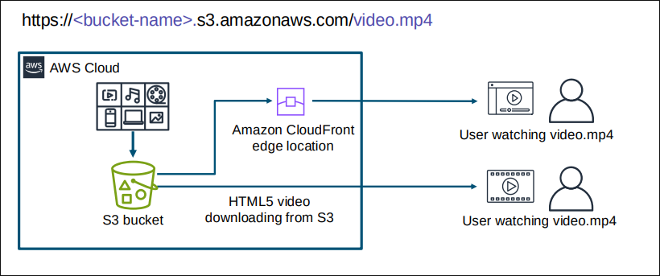
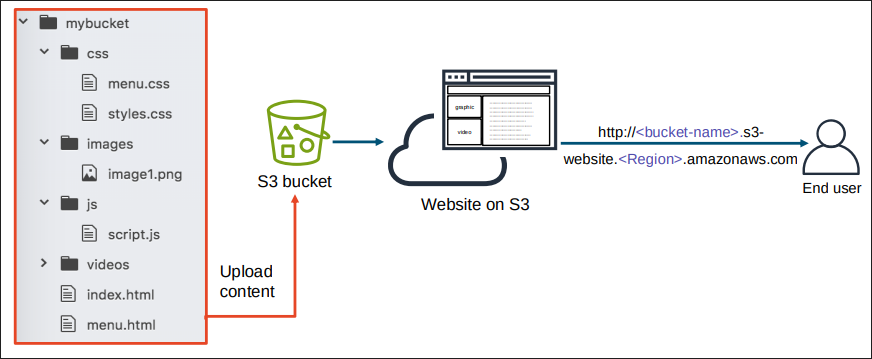
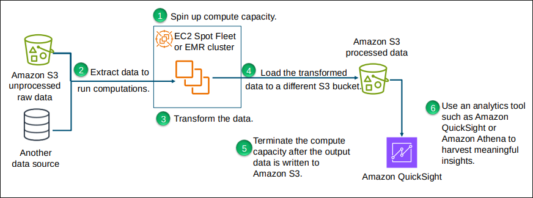
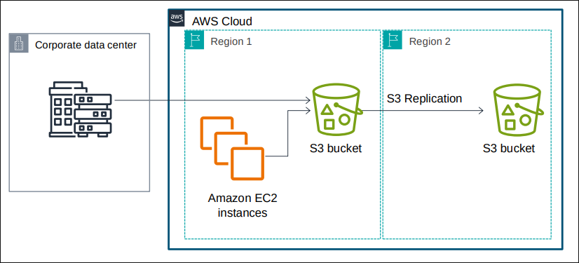

# Cloud Storage Types

## Storage as SaaS

- Many cloud storage services act like an extension to the local hard drive
- They provide similar features to a local file system
- With some "cloud" features:
  - Sharing
  - Collaborative editnig
  - Versioning
- e.g. Google Drive, OneDrive, Dropbox, iCloud

## Storage as IaaS/PaaS

- Storage srevices provided as independent "infrastructure" or as part of the other infrastructure or platform
  - e.g. AWS S3, other AWS storage types that can be mounted to EC2 instances, Azure storage, Google Cloud Storage
- Less end user UI features but allow for more control in other aspects
- Usually more cost-effective

## AWS Data Storage Services

S3
- Access: AWS API (SKD, CLI), third-party tools
- Maximum storage volume: unlimited
- Latency: High
- Storage Cost: Very low

EBS (SSD)
- Access: Attached to an EC2 instance via network
- Maximum storage volume: 16 TiB
- Latency: Low
- Storage Cost: Low

EC2 Instance Store (SSD)
- Access: Attached to an EC2 instance directly
- Maximum storage volume: 305 TB
- Latency: Very low
- Storage Cost: Very low

EFS
- Access: NFSv4.1, e.g. from an EC2 instance or on-premises
- Maximum storage volume: unlimited
- Latency: Medium
- Storage cost: Medium

# Amazon S3: A Distributed Object Store

## S3 File Store and Object Store

- In a typical file storage system, data is managed in a hierarchy consisting of folders and files
  - Files represent data
- In an object storage, data is stored as objects
- Each object consists of:
  - A globally unique identifier
  - Some metadata
    - Access control, object size, etc
  - The content itself
    - Similar to a file

## S3 - Simple Storage Service

- One of the oldest services provided by AWS
- Each data is an object with a unique identifier (key)
- Data can be uploaded and retrieved through HTTPS as objects via APIs
- Local file vs S3 object:
  - Every "file" we store in S3 becomes an object
  - The content part is the same
  - The difference is in how data is organised, accessed, and the metadata

## Data Organisation: S3 Buckets

- Users will have lots of objects to store
- They can be organised into buckets
  - A bucket is a container for objects
- S3 uses a flat structure consisting of buckets and objects
  - There is no further organisation within a bucket
  - Different to a hierarchical file structure
- An account can have many buckets
  - Each bucket needs to have a globally unique name
  - This helps make the object identifier unique

## Benefits of a Flat Structure

- An S3 bucket can store an unlimited number of objects
- Objects belonging to the same bucket do not necessarily reside on the same physical machine
- Objects in the same "folder" don't either
- Object key (bucket_name + object_prefix + object_filename) determines the physical location of the object

## Object Concept

- Most objects stored in S3 are files, uploaded by the user or stored by other AWS services
- There are some special objects:
  - Folder is a 0 byte object
  - Delete marker in a versioned S3 bucket

## S3 Bucket URLs

- To upload data:
  - Create a bucket in an AWS Region
  - Upload almost any number of objects to the bucket
- Bucket path-style URL endpoint: `https://s3.ap-northeast-1.amazonaws.com/bucketname`
- Bucket virtual hosted style URL endpoint: `https://bucket-name.s3-ap-northeast-1.amazonaws.com`
- The default region is "us-east-1" which can be omitted

## S3 Object Key Name and URL

- S3 provides a pseudo directory structure to mimic file system organisation
  - The directory name is the prefix of the object key name
e.g. media/welcome.mp4, media will be treated like a directory in the AWS S3 console

## Common Scenarios for S3

- Backup and storage
- Application hosting
- Media hosting
- Software delivery

## S3 Pricing

- Pay only for what you use:
  - GBs per month
  - Transfer OUT to other Regions
  - PUT, COPY, POST, LIST, and GET requests

- You do not pay for:
  - Transfers IN to S3
  - Transfers OUT from S3 to CloudFront or EC2 in the same Region

## S3 Storage Pricing

To estimate S3 costs, consider:

1. Storage class type:
  - Standard storage is designed for:
    - 11 9s of durability
    - 4 9s of availability
  - S3 Standard-Infrequent Access (S-IA) is designed for:
    - 11 9s of durability
    - 3 9s of availability
2. Amount of storage:
  - The number and size of objects
3. Requests:
  - The number and type of request (GET, PUT, COPY)
  - Type of requests:
    - Different rates for GET requests compared to others
4. Data transfer:
  - Pricing is based on the amount of data that is transferred out of the Amazon S3 Region
    - Data transfer in is free, but charges are incurred for data that is transferred out

# S3 Common Use Cases

## S3 Use Case: Media Hosting

- User watching a video can access it via the S3 link (e.g. https://bucket-name.s3.amazonaws.com/video.mp4)

## S3 Use Case: Hosting Static Websites

- Upload the static website to the S3 bucket
- The user can access the website via S3

## S3 Use Case: Data Store for Computation and Analytics

- Store raw data in S3
- Use EC2 to extract data and run computations and transform the data
- Load the transformed data into a different S3 bucket

## S3 Use Case: Backup and Archive Critical Data

- Data centre and EC2 instances are connected to the S3 bucket in Region 1
- S3 Replication is used to replicate the data to an S3 bucket in Region 2

# S3 Storage Options

## S3 Object Storage Classes

General Purpose
- S3 Standard

Intelligent Tiering
- S3 Intelligent-Tiering

Infrequent Access
- S3 Standard-IA
- S3 One Zone-IA

Archive
- S3 Glacier Instant Retrieval
- S3 Glacier Flexible Retrieval
- S3 Glacier Deep Archive
- S3 on Outposts

## S3 Storage Classes Breakdown

|   | S3 Standard | S3 Intelligent-Tiering | S3 Standard-IA | S3 One Zone-IA | S3 Glacier Instant Retrieval | S3 Glacier Flexible Retrieval | S3 Glacier Deep Archive| 
|---|-------------|------------------------|----------------|----------------|------------------------------|-------------------------------|------------------------|
| Availability Zones | >= 3 | >= 3 | >= 3 | 1 | >= 3 | >= 3 | >= 3 |
| Minimum capacity charge for each object | N/A | N/A | 128KB | 128 KB | 128KB | N/A | N/A |
| Minimum storage duration charge | N/A | N/A | 30 days | 30 days | 90 days | 90 days | 90 days | 180 days |
| Retrieval charge | N/A | N/A | Per GB retrieved | Per GB retrieved | Per GB retrieved | Per GB retrieved | Per GB retrieved |

## Configuring an Amazon S3 Lifecycle

- S3 lifecycle configurations: a set of rules that define actions that S3 applies to a group of objects
  - Transition actions transition to another storage class
  - Expiration actions define when objects expire

Set an S3 lifecycle policy -> data will automatically transfer to a different storage class without any changes to your application

## S3 Lifecycle Examples

1. S3 Standard for 30 days -> Delete
2. Amazon S3 Glacier archived for 10 years (regulatory compliance)
3. S3 Standard frequently accessed for 60 days -> S3 Standard-IA infrequently accessed for 1 year -> S3 Glacier archived for 7 years -> Delete

# S3 Versioning

## S3 Versioning

- Protects objects from accidental overwrites and deletes

| Action | Versioning Enabled | Versioning Disabled or Suspended |
|--------|--------------------|----------------------------------|
| Upload an object with the same key | Creates a new object with a different version ID, and both are retrievable by the version ID | Overwrites the original object, and the previous object is no longer retrievable |
| Delete | Adds a delete market, but the object is still retrievable by the version ID | Deletes the object, and it is no longer retrievable |

## Adding an Object in a Versioning-Enabled Bucket

`PUT Object key = photo.gif`

- S3 generates a new version ID and adds this newer version of the object to the bucket
- The original version remains in the bucket

## Deleting an Object in a Versioning-Enabled Bucket

`DELETE Object key = photo.gif`

- All versions remain in the bucket, S3 inserts a delete marker

## Retrieving the Most Recently Stored Version in a Versioning-Enabled Bucket

`GET Object key = photo.gif`

- Requests for an object key, return the most recent version
- If the most recent version is a delete market, the request is not successful

## Retrieving an Object with its Specific ID

`GET Object key = photo.gif with version ID = 121245`

- Requests for an object with its version ID will successfully return that version of the object

## Permanently Deleting an Object

`DELETE Object key = photo.gif with version ID = 121245`

- Owners of the bucket can permanently delete an object with the version ID
- In this case, no delete market is added, and the specific version is not recoverable

## S3 Data Consistency Model

- Consistent for all new and existing objects in all Regions
- Provides read-after-write consistency for all GET, LIST, PUT, and DELETE operations on objects in S3 buckets
- Offers an advantage for big data workloads
- Simplifies the migration of on-premise analytics workloads

## S3 Redundancy vs Data Versioning

S3 Redundancy:

- Purpose: ensures high availability and durability of data
- How it works:
  - Automatically stores data across multiple devices and AZs
  - Protects against hardware failures and data centre outages
- Key benefit: provides fault tolerance and continuous access to data
- Extra cost: none, default feature

S3 Versioning:

- Purpose: protect against accidental deletions and overwrites
- How it works:
  - Maintains multiple versions of an object in the same bucket
  - Enables restoration of previous versions if needed
- Key benefit: offers a robust audit trail and easy recovery of data modifications
- Extra cost: may incur extra storage costs

When versioning is enabled, each version will be redundantly stored in multiple facilities by default

# S3 Replication

## What is S3 Replication?

- A feature that automatically copies objects from one bucket (source) to another bucket(s) (destination(s))
- Requires versioning to be enabled in both source and destination buckets
- Why replicate data?
  - Additional data recovery (in addition to data redundancy)
  - Satisfy compliance
  - Latency improvement

## S3 Replication Features

- Same Region (US East -> US East)
- Cross Region (US East -> US West)
- Cross-Account (Account A -> Account B)
- Multi-destination (US East -> US West, US East -> US East)
- Existing Objects (US East -> US West)

## How Delete Operations Affect Replication

- If you make a DELETE request without specifying an object version ID, S3 adds a delete marker
- S3 deals with the default marker as follows:
  - By default, S3 adds a delete market in the source bucket only
  - The delete market is not copied to the destination bucket by default
  - This can cause consistency issues
  - You can enable delete marker replication, and it copies markers to the destination buckets, and S3 behaves as if the object was deleted in both source and destination buckets

- If you specify an object version ID to delete in a DELETE request
  - Amazon S3 deletes that object version in the source bucket only
  - Consistency issues
  - Users need to manually delete the version in the target bucket

## S3 Replication and Versioning Behaviours

`PUT Object key = photo.gif`

- S3 generated a new version ID and adds this newer version of the object to thebucket
- Original version remains in the bucket
- New version is replicated to the target bucket

`DELETE Object key = photo.gif`

- All versions remain in the bucket, but S3 inserts a delete market
- By default, the delete market is not replicated to the target bucket

`DELETE Object key = photo.gif with version ID = 121245`

- No delete market is added, and the specified version will be deleted in the source bucket
- Not replicated in the target bucket
- Need to manually delete the same version in the target bucket
